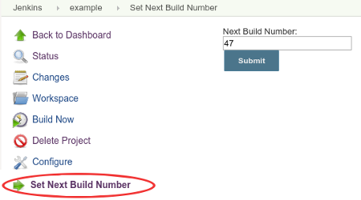

# Next Build Number Plugin

[](https://plugins.jenkins.io/next-build-number)
[](https://github.com/jenkinsci/next-build-number-plugin/blob/master/README.md#changelog)
[](https://plugins.jenkins.io/next-build-number)

This is a simple plugin that changes the next build number Jenkins will
use for a job.  
This plugin is typically useful if you are using `$BUILD_NUMBER` as
part of a version string, and:

-   You do a build outside of Jenkins and you want to skip that number
    for the next build to avoid duplicate version numbers or failures.
-   You created a new job to handle an existing process and want it to
    continue from where the old one left off.

Jenkins requires that **build numbers are not duplicated**. When you
click on the link installed by this plugin, a text field will be shown
that contains the next build number to be used. You can change this
number to be anything larger than the value **for the most recent build**

Note: **Changing this to a number lower than the latest build number will do nothing**.
You can, however, go back to a previously used number if you delete builds. 

The value can be changed:

-   Graphically by using the Set Next Build Number **link** for each job
    (see screenshot)
-   Via the CLI using the `set-next-build-number` command (Requires \>=
    v1.1)
-   Programmatically via the **Job DSL** plugin
    (see [usage](#Job DSL)). (Requires \>= v1.3 of
    this plugin and Job DSL \>= 1.41)

Manual Usage:



**Note**: Not all job types are supported.  If support is missing for
your job type, feel free to make a Pull Request!

## Job DSL

The build number can be changed as part of a Job DSL script.

``` syntaxhighlighter-pre
job('example') {
  properties {
    nextBuildNumber(47)
  }
}
```

## Changelog

### Version 1.8

- Prevent non-numeric input when setting next build number interactively (Thanks [NotMyFault](https://github.com/jenkinsci/next-build-number-plugin/pull/11)!)

### Version 1.7

- Fix multibranch job support in Jenkins \>= 2.266 (Thanks [eoc-ross](https://github.com/jenkinsci/next-build-number-plugin/pull/10)!)

### Version 1.6

- Support more job types (Organization Folders) (Thanks [res0nance](https://github.com/jenkinsci/next-build-number-plugin/pull/7)!)

### Version 1.5

- Support more job types (individual jobs from Multibranch Pipelines) (Thanks [rjohnst](https://github.com/jenkinsci/next-build-number-plugin/pull/6)!)

### Version 1.4

- Support more job types (eg Pipeline) (Thanks [kad](https://github.com/jenkinsci/next-build-number-plugin/pull/5)!)

### Version 1.3

- Add Job DSL extension point to allow specifying the nextBuildNumber at job creation time (Thanks [daspilker](https://github.com/jenkinsci/next-build-number-plugin/pull/4)!)

### Version 1.1

- Add CLI command ([JENKINS-14406](https://issues.jenkins-ci.org/browse/JENKINS-14406))
